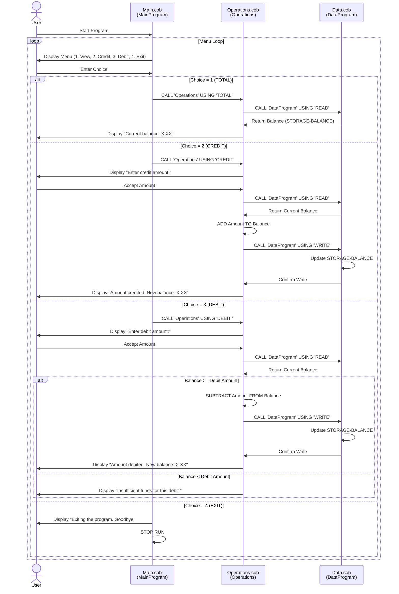

# COBOL Legacy Code Documentation

## Overview

This documentation provides a comprehensive overview of the COBOL-based Student Account Management System. The system is designed to handle student account operations including balance inquiries, credits, and debits.

---

## File Structure

The COBOL application consists of three main programs:

- **main.cob** - Entry point and user interface
- **data.cob** - Data persistence and storage layer
- **operations.cob** - Business logic and account operations

---

## File Descriptions

### 1. main.cob - MainProgram

**Purpose:**
The main program serves as the entry point and user interface for the Student Account Management System. It provides a menu-driven interface that allows users to interact with the system.

**Key Functions:**

| Function | Description |
|----------|-------------|
| Menu Display | Presents a numbered menu with four options to the user |
| User Input | Accepts user choice (1-4) via ACCEPT statement |
| Operation Routing | Routes user selections to the appropriate operations program |
| Loop Control | Continues operation until user selects Exit option |

**Business Rules:**

- The system operates in a continuous loop until the user selects option 4 (Exit)
- Invalid selections (not 1-4) display an error message and prompt again
- The menu options are:
  1. **View Balance** - Display current account balance
  2. **Credit Account** - Add funds to the account
  3. **Debit Account** - Subtract funds from the account
  4. **Exit** - Terminate the program

**Data Variables:**

- `USER-CHOICE` (PIC 9) - Stores the user's menu selection
- `CONTINUE-FLAG` (PIC X(3)) - Controls the main execution loop

---

### 2. data.cob - DataProgram

**Purpose:**
The data program handles all persistent data storage and retrieval operations for student accounts. It acts as the data access layer, managing the account balance state.

**Key Functions:**

| Function | Description |
|----------|-------------|
| READ Operation | Retrieves the current account balance from storage |
| WRITE Operation | Persists the account balance to storage |

**Business Rules:**

- Initial account balance is set to 1000.00
- The program accepts operation type and balance as parameters
- READ operations pass the storage balance to the calling program
- WRITE operations update the stored balance with values provided by the calling program

**Data Variables:**

- `STORAGE-BALANCE` (PIC 9(6)V99) - Persistent account balance, initialized to 1000.00
- `OPERATION-TYPE` (PIC X(6)) - Determines READ or WRITE action
- `PASSED-OPERATION` (LINKAGE) - Operation type passed from caller
- `BALANCE` (LINKAGE) - Balance value for READ/WRITE operations

**Operation Types:**

- `'READ'` - Retrieve current balance from storage
- `'WRITE'` - Update storage with new balance

---

### 3. operations.cob - Operations

**Purpose:**
The operations program implements the core business logic for account management operations. It processes balance inquiries, credit transactions, and debit transactions while enforcing business rules.

**Key Functions:**

| Function | Description |
|----------|-------------|
| TOTAL | Display the current account balance |
| CREDIT | Add a specified amount to the account balance |
| DEBIT | Subtract a specified amount from the account balance with validation |

**Business Rules:**

1. **View Balance (TOTAL)**
   - Reads the current balance from the data program
   - Displays it to the user

2. **Credit Account (CREDIT)**
   - Prompts user for the credit amount
   - Reads current balance
   - Adds the credit amount to the balance
   - Updates storage with the new balance
   - Displays the updated balance

3. **Debit Account (DEBIT)**
   - Prompts user for the debit amount
   - Reads current balance
   - **Validates sufficient funds**: Debit amount must not exceed current balance
   - If valid: Subtracts amount and updates storage
   - If invalid: Displays "Insufficient funds" message
   - Only displays updated balance if debit was successful

**Data Variables:**

- `OPERATION-TYPE` (PIC X(6)) - Type of operation (TOTAL, CREDIT, DEBIT)
- `AMOUNT` (PIC 9(6)V99) - Transaction amount
- `FINAL-BALANCE` (PIC 9(6)V99) - Current account balance, initialized to 1000.00
- `PASSED-OPERATION` (LINKAGE) - Operation type passed from main program

---

## System Workflow

```
START (main.cob)
  │
  ├─→ Display Menu
  │
  ├─→ Accept User Choice
  │
  ├─→ Route to Operations
  │    │
  │    ├─→ TOTAL: Read balance from Data → Display
  │    │
  │    ├─→ CREDIT: Accept amount → Read balance → Add → Write to Data → Display new balance
  │    │
  │    └─→ DEBIT: Accept amount → Read balance → Validate funds → Subtract → Write to Data → Display new balance
  │
  └─→ Repeat until EXIT selected → STOP
```

---

## Student Account Business Rules Summary

1. **Initial Balance**: Every student account starts with a balance of 1000.00
2. **Balance Inquiries**: Users can view their current balance at any time without restrictions
3. **Credits**: Students can add funds to their account in any amount
4. **Debits**: Students can only debit (withdraw) funds if sufficient balance exists
5. **Insufficient Funds Protection**: The system prevents overdrafts by validating debit amounts against available balance
6. **Transaction Logging**: All operations update the persistent balance immediately

---

## Data Types

- `PIC 9(6)V99` - Numeric field representing currency (6 digits before decimal, 2 after), range 0-999999.99
- `PIC 9` - Single digit numeric field
- `PIC X(3)` - 3-character alphanumeric field
- `PIC X(6)` - 6-character alphanumeric field

---

## Notes for Modernization

This system is a candidate for modernization to:
- Replace COBOL with modern programming languages
- Implement database persistence instead of in-memory storage
- Add authentication and security layers
- Implement audit logging for all transactions
- Add batch processing capabilities
- Integrate with modern APIs and services

---

## System Data Flow Sequence Diagram

The following diagram illustrates the interaction between system components and data flow for each operation:


